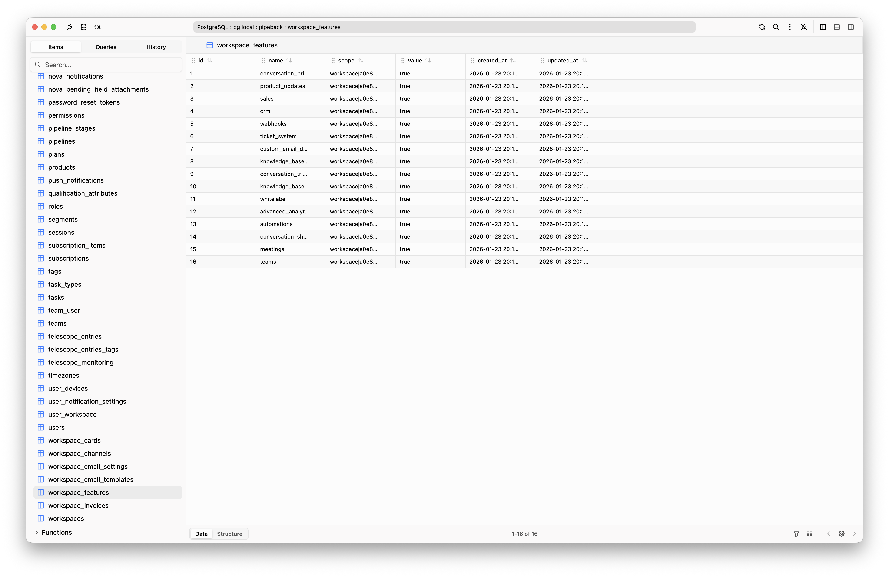
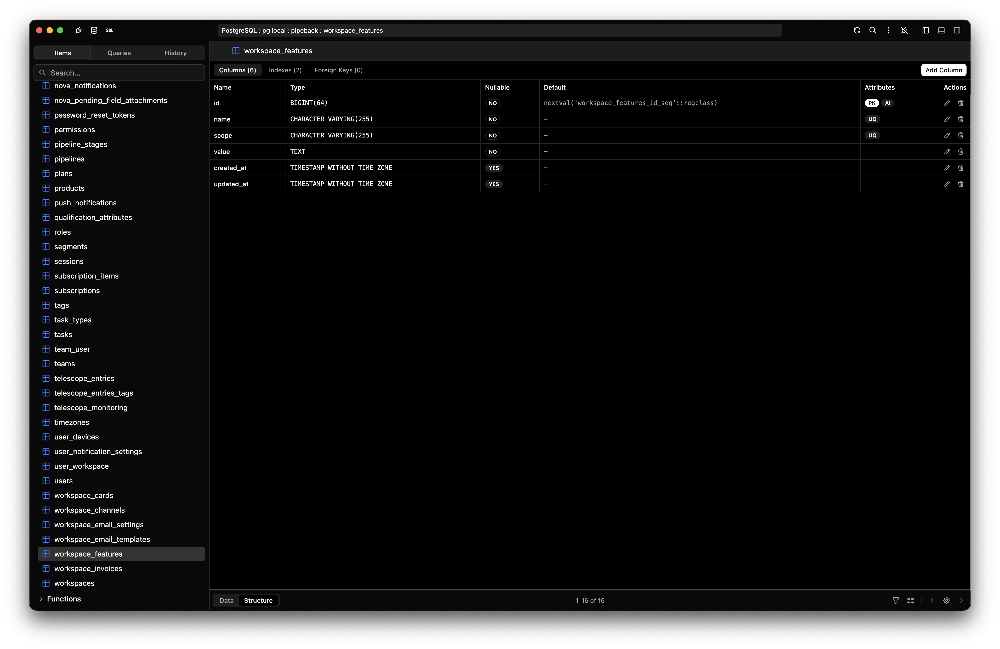
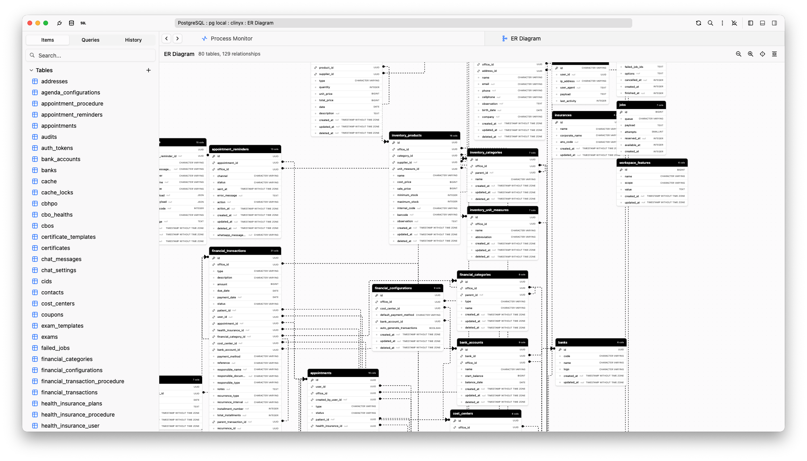

<p align="center">
  
</p>

<h1 align="center">Zequel</h1>

<p align="center">
  A modern, open-source database management GUI for macOS, Windows, and Linux.
</p>

<p align="center">
  <a href="https://github.com/zequelhq/zequel/releases"></a>
  <a href="https://github.com/zequelhq/zequel/blob/main/LICENSE"></a>
  <a href="https://github.com/zequelhq/zequel/stargazers"></a>
  <a href="https://github.com/zequelhq/zequel/issues"></a>
  <a href="https://github.com/zequelhq/zequel/pulls"></a>
</p>

---

<p align="center">
  
</p>
<p align="center">
  
</p>
<p align="center">
  
</p>

## Supported Databases

| | Database | Version | SSH Tunnel |
|---|----------|---------|------------|
|  | PostgreSQL | 17+ | Yes |
|  | MySQL | 8.4+ | Yes |
|  | MariaDB | 11+ | Yes |
|  | SQLite | 3+ | - |
|  | MongoDB | 8+ | Yes |
|  | Redis | 7+ | Yes |
|  | ClickHouse | 24+ | Yes |

## Features

- **Query Editor** - Monaco-based editor with syntax highlighting, auto-complete, multiple tabs, parameterized queries, EXPLAIN visualization, and 30+ SQL snippets per dialect
- **Schema Browser** - Explore and manage databases, tables, columns, indexes, foreign keys, views, routines, triggers, sequences, enums, and extensions
- **Data Grid** - Virtual-scrolled grid with in-cell editing, filtering, sorting, column resize/reorder, multi-row selection, bulk operations, and undo/redo
- **ER Diagrams** - Interactive entity-relationship diagram visualization
- **Import / Export** - CSV, JSON, SQL, and Excel formats
- **Security** - SSL/TLS connections, SSH tunneling, OS-level credential storage
- **Process Monitor** - View and manage active database processes
- **Command Palette** - Quick access to all actions via `Cmd+K` / `Ctrl+K`
- **Dark / Light Theme** - Follows system preference or manual toggle
- **Cross-platform** - Native builds for macOS (Intel + Apple Silicon), Windows, and Linux

## Download

Get the latest release for your platform:

| Platform | Download |
|----------|----------|
| macOS (Apple Silicon) | [Zequel-arm64.dmg](https://github.com/zequelhq/zequel/releases/latest) |
| macOS (Intel) | [Zequel.dmg](https://github.com/zequelhq/zequel/releases/latest) |
| Windows | [Zequel-Setup.exe](https://github.com/zequelhq/zequel/releases/latest) |
| Linux | [Zequel.AppImage](https://github.com/zequelhq/zequel/releases/latest) |

## Contributing

Contributions are welcome! Whether it's bug reports, feature requests, or pull requests — all help is appreciated.

See the [Development Setup](docs/contributing/development-setup.md) guide to get started.

### Opening a Pull Request

1. Fork the repository and create your branch from `main`:

```bash
git checkout -b my-feature
```

2. Make your changes. Follow the existing code style and conventions.

3. If you added or changed functionality, add or update tests.

4. Run the type checker and tests to make sure nothing is broken:

```bash
npm run typecheck
npm run test:unit
```

5. Commit your changes with a clear message describing what and why.

6. Push to your fork and open a Pull Request against `main`.

## Documentation

Full documentation is available at [docs.zequel.dev](https://docs.zequel.dev) (or run `npm run docs:dev` locally).

- [Development Setup](https://docs.zequel.dev/contributing/development-setup) - Setup, project structure, and guidelines
- [Connection URLs](https://docs.zequel.dev/contributing/connection-urls) - Test database connection strings
- [Releasing](https://docs.zequel.dev/contributing/releasing) - How to release a new version
- [App Icons](https://docs.zequel.dev/contributing/app-icons) - Generating app icons

## Author

Created by **Paulo Castellano**

- GitHub: [@paulocastellano](https://github.com/paulocastellano)
- X: [@paulocastellano](https://x.com/paulocastellano)

## License

[Elastic License 2.0](LICENSE)
